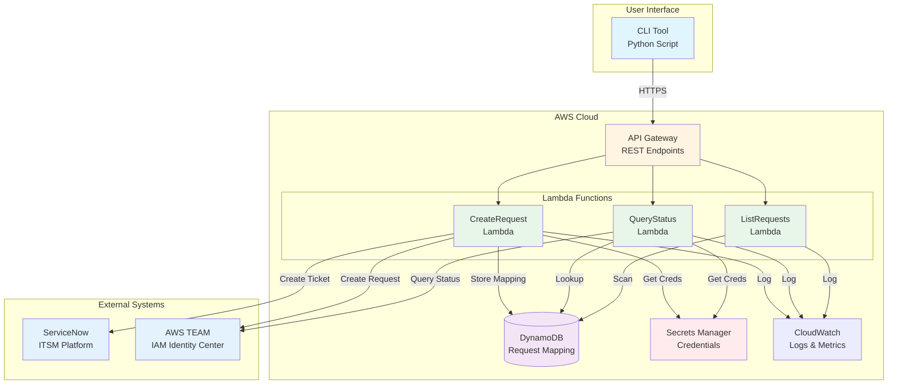
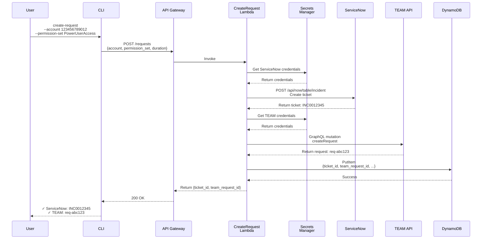
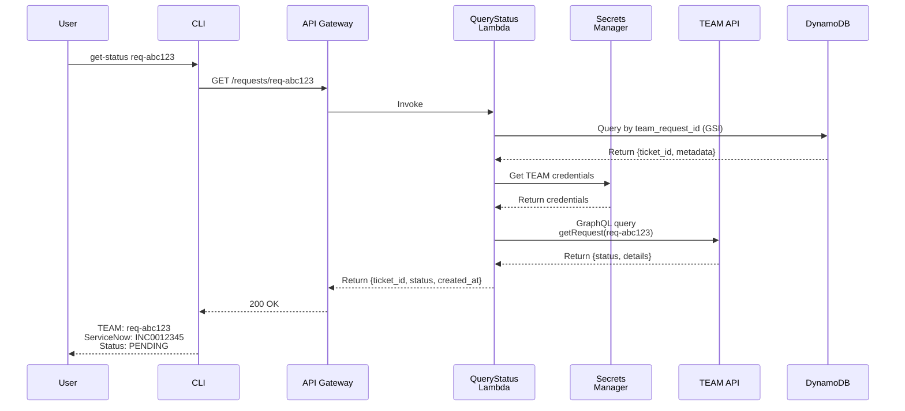
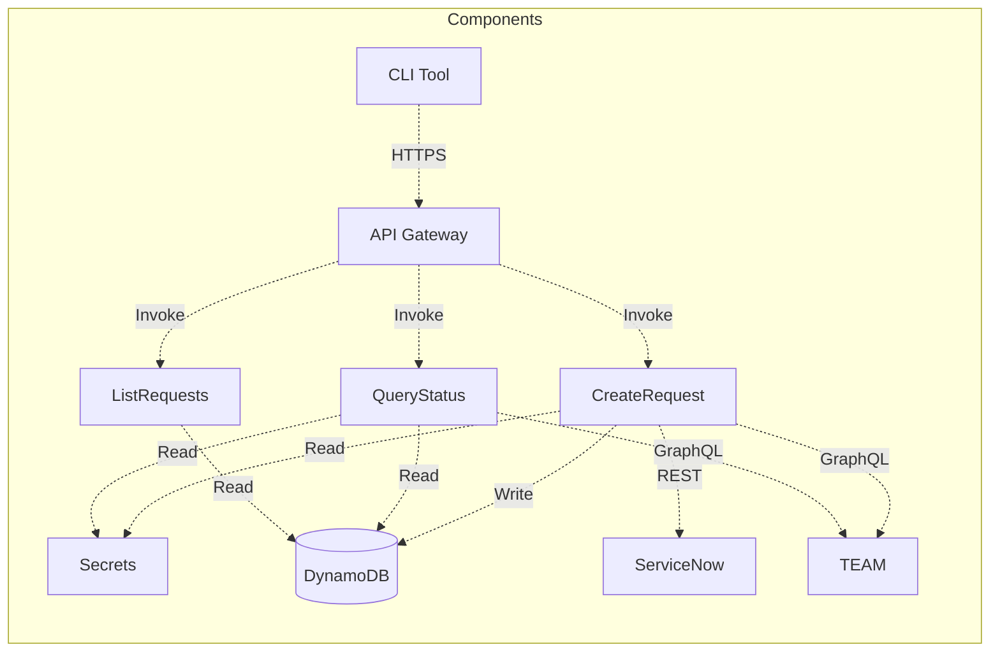
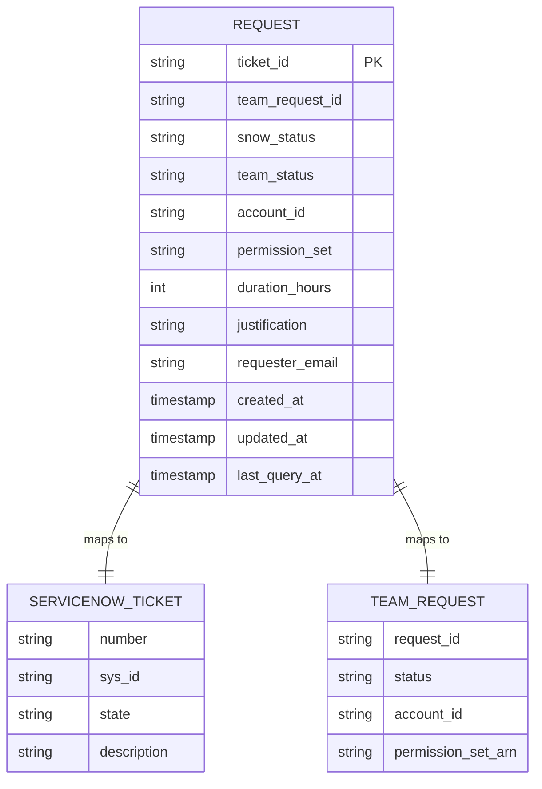
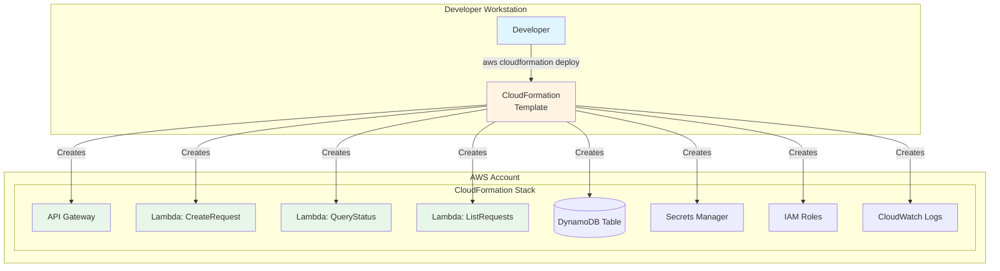
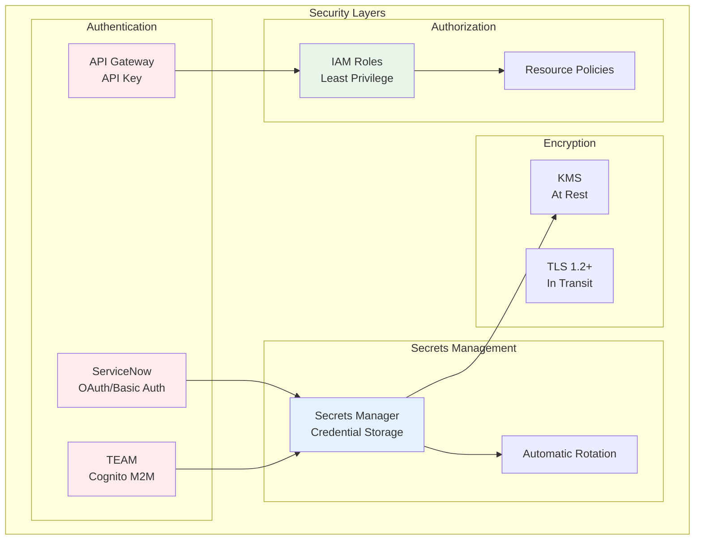
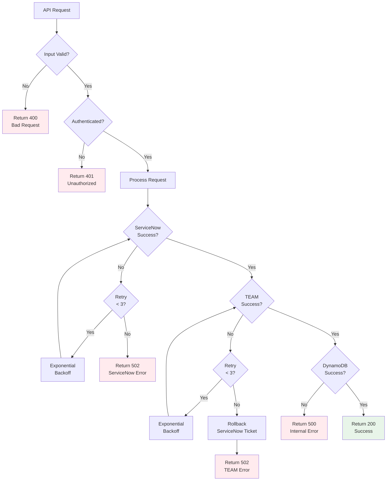
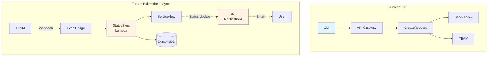
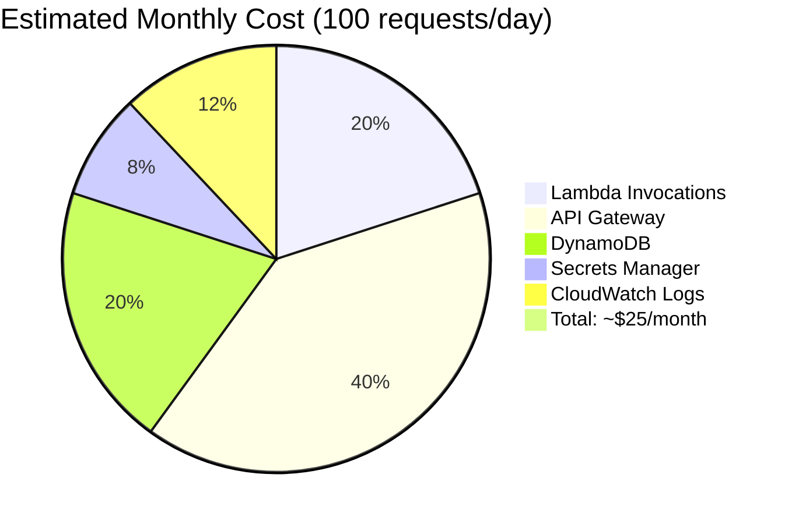

# ServiceNow-TEAM Integration POC - Architecture Diagrams

## High-Level Architecture

## Request Creation Flow

## Status Query Flow

## Component Interaction Matrix

## Data Model

## Deployment Architecture

## Security Architecture

## Error Handling Flow

## Future State: Bidirectional Sync (Phase 2)

## Cost Estimate (Monthly)

